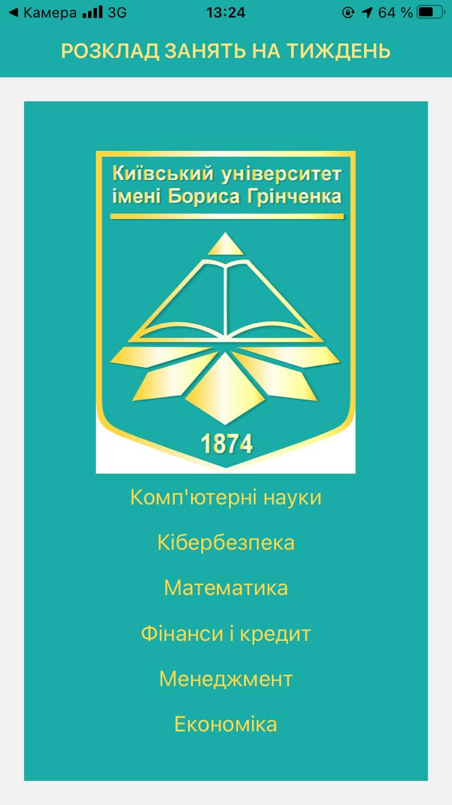
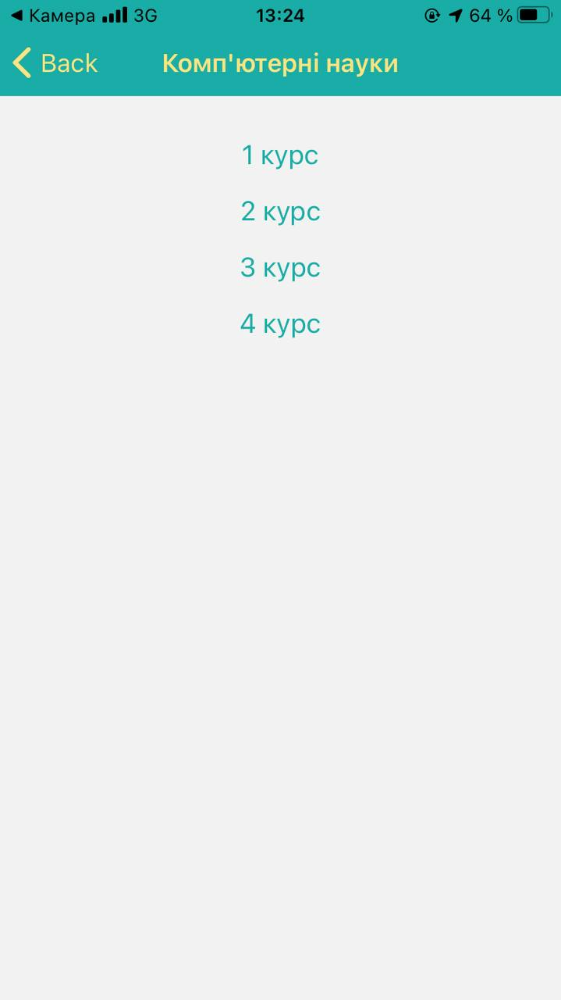
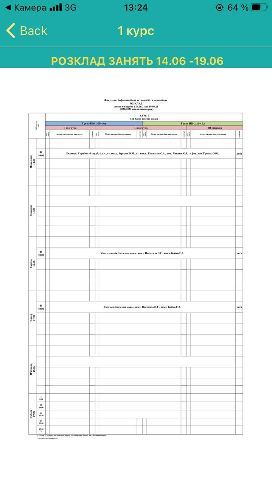

# To get shedule

## Launch
to launch app for Android or IOS you can use 
[link](https://snack.expo.io/@npsavchuk.fitu17/practice_2020) 
or
[link](https://snack.expo.io/@vbbahaturiia/practice_2020) 

____

## How to use application

### Open the shedule:

1.   Press on the button “Комп’ютерні науки/Кібербезпека/Математика/Фінанси і Кредит/Менеджмент/Економіка"

2.   Press on the button “1 курс/2 курс/3 курс/4 курс"

3.Result:

____

### Back to Main Screen:

1.   Press on "<--" and back to Main Screen
